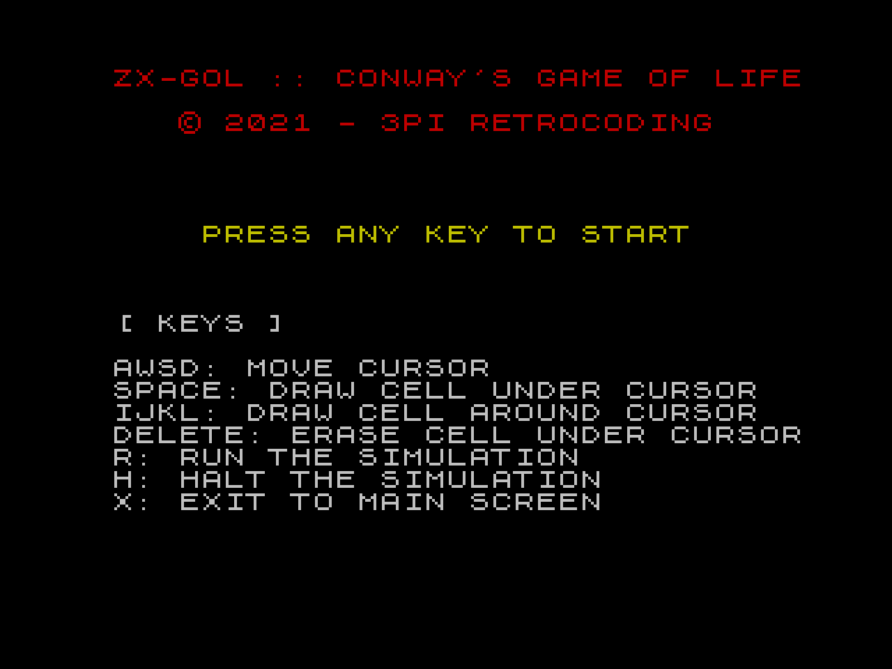

# ZX-GOL

## Z80 Assembly Conway's Game of Life for the Sinclair ZX-Spectrum 48K

The code ha been developed and tested on Fuse with the Pasmo assembler.

## Usage

Assemble with: pasmo --tap zxgol.asm zxgol.tap

Load zxgol.tap file in Fuse

Execute the program with: RANDOMIZE USR 33000

Have fun!

